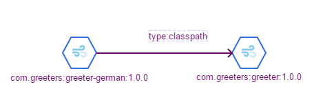
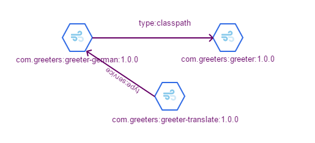

# The Dependency Graph

## Declaring a Dependency

Say you have a simple greeter program that exports an interface:

*Greeter.java*
```java
public interface Greeter {
    String greet(String name);
}
```
and you define it in your plugin:

*com.greeters:greeter/plugin.yaml*
```yaml
plugin:
    name: greeter
    group: com.greeters
    version: 1.0.0-SNAPSHOT
    type: plugin
    description: Friendly ways to say hello!
```

This interface is known as an `extension point` -- i.e. it's a service contract
that is exported by your plugin that may be `satisfied` by other plugins.  

Say you publish your plugin to a central repository, and now a German colleague wants to implement a plugin that satisifies your extension point:

*GermanGreeter.java*
```java
public class GermanGreeter implements Greeter {
    @Override
    public String greet(String name) {
        return String.format("Gutten Tag, %s!", name);
    }
}
```

And your colleague publishes it to a central repository with the following definition:

*com.greeters:greeter-german/plugin.yaml*
```yaml
plugin:
    name: greeter-german
    group: com.greeters
    version: 1.0.0-SNAPSHOT
    type: plugin
    description: Freundliche Art Hallo zu sagen!
    dependencies:
      - dependency:
          required: true
          type: classpath 
          group: com.greeters
          name: greeter
          version: 1.0.0
```

This arrangement corresponds to the following dependency-graph:



When Zephyr processes such a graph, it will locate all of the required plugins 
(`com.greeters:greeter-german`, `com.greeters:greeter`) and install them.  If Zephyr cannot locate one of them, the installation
process fails for both.


## Consuming Services within the Dependency Graph

In the example, `GermanGreeter` may be used as a standalone service by its host plugin, `greeter-german`, or it may be consumed by
other dependencies.  Suppose you'd like to create a translation service that can translate a greeting into as many languages as there
are plugins that satisfy the `Greeter` interface:

*TranslatingGreeter.java*
```java
class TranslatingGreeter implements Greeter {
    private final ServiceRegistry registry;
    public TranslatingGreeter(ServiceRegistry registry) {
        this.registry = registry;
    }
    
    @Override
    public String greet(String name) {
        Set<Greeter> greeters = registry.resolve(Greeter.class);
        StringBuilder result = new StringBuilder();
        for(Greeter greeter : greeters) {
            result.append(greeter.greet(name)).append("\n");
        }
        return result.toString();
    }
}
```
And this plugin depends on at least the `greeter-german` plugin:
*com.greeters:greeters-translate/plugin.yaml*
```yaml
plugin:
    name: greeters-translate 
    group: com.greeters
    version: 1.0.0-SNAPSHOT
    type: plugin
    description: Freundliche Art Hallo zu sagen!
    dependencies:
      - dependency:
          required: true
          type: service 
          group: com.greeters
          name: greeter-german
          version: 1.0.0
```

Now, the dependency graph looks like:


Since `greeters-translate` has a `service` dependency on `greeters-german`, Zephyr will start `greeters-german` before `greeters-translate`,
and `greeters-translate`'s output will be:

```
Gutten Tag, <name>!
```
when called by any consuming services with the parameter `<name>`.

### Dynamic Dependencies
Obviously, forcing `greeters-translate` to maintain a static list of `Greeter` extension-point implementations defeats
the purpose of a dynamic plugin system.  It's more common to omit the dependency from `greeters-translate` to `greeter-german`
and instead add a dependency from `greeter-german` (or any other implementation of `Greeter`) to `greeters-translate` and have
`greeters-translate` perform an action once a new greeter implementation has been registered.  Zephyr provides two general
patterns for this:

#### The Whiteboard Pattern

#### The Observer Pattern 

### Dependency Types


