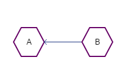

# What is Zephyr?

Zephyr is a platform for building and testing _modular_ applications. A _modular_ application is an
application whose functionality may dynamically be extended by _modules_. But what's a module?

Let's start off with a few examples of modular applications:

1. [Wordpress](https:/www.wordpress.com)
2. [Visual Studio](https:/visualstudio.microsoft.com)
3. [Intellij](https:/jetbrains.com)
4. [Gimp](https:/gimp.org)

The list goes on. It turns out that application modularity is a powerful capability. Unfortunately,
building modular applications can be difficult: developers are left to either create their own
module framework or use an existing module framework such as:

1. An OSGi implementation [Eclipse Equinox](https:/www.eclipse.org/equinox/)
   or [Felix](https:/felix.apache.org)
2. [PF4j](https:/github.com/pf4j/pf4j)
3. Other platform or language-specific module frameworks such as DLLs/Shared Objects

Often, solutions that work for one person's use-cases won't work for someone else's.

## Why another framework?

Zephyr was born from our frustrations with trying to wrangle many dynamic dependencies here
at [Sunshower.io](https:/sunshower.io). Initially, we had just a few modules, and that worked well.
As the number and complexity of our modules increased, so did the amount of time we spent fixing
issues with the various modular frameworks that we'd attempted to use. Eventually, we'd come to
realize that many existing solutions solve for problems that we did not have without providing clean
solutions for the problems that we did:

| Feature                           | Zephyr            | Competitors              |
| :---                              |    :----:         |          ---:            |
| Thread-safety                     | Yes               |  No                      |
| Sharing                           | Open by default   | Isolated by default      |
| Topological Lifecycle Ordering    | Yes               |  No                      |
| Integrated Testing Support        | Yes               |  No                      |
| Integrated SPA UI Support         | Yes               |  No                      |
| Concurrent Module Lifecycle       | Yes               |  No                      |
| Package Format                    | Extensible        |  Fixed                   |
| Global Framework Support          | Supported         |  Unsupported             |

Obviously, some frameworks will adopt one feature or convention whereas others won't, but these are
broadly the themes that we encountered before developing Zephyr. Let's go over each!

## Thread-Safety

A *thread-safe* system is one that you can interact with concurrently such that its behavior is
always well-defined. Thread-safety is a large and complex issue, and understandably, many existing
systems don't attempt to address it: interact with the system from one thread or you're taking your
life into your own hands!  Zephyr takes the opposite approach: it should _Just Work_<sup>TM</sup>
whatever concurrency model you're dealing with.

A good example (and the one that users will probably use the most) is the `ModuleContext` API:

```java
public interface ModuleContext extends VolatileStorage {

  <T> T unwrap(Class<T> type);

  <T> Predicate<T> createFilter(Query<T> query);

  <T> CapabilityRegistration<T> provide(CapabilityDefinition<T> capability);

  <T> RequirementRegistration<T> createRequirement(Requirement<T> requirement);

  Module getModule();

  List<Module> getModules(Predicate<Module> filter);

  ModuleTracker trackModules(Predicate<Module> filter);

  ModuleTracker trackModules(Query<Module> filter);

  ServiceTracker trackServices(Query<ServiceReference<?>> filter);

  ServiceTracker trackServices(Predicate<ServiceReference<?>> filter);

  <T> ServiceRegistration<T> register(ServiceDefinition<T> definition);

  <T> ServiceRegistration<T> register(Class<T> type, String name, T value);

  <T> ServiceRegistration<T> register(Class<T> type, T value);

  <T> ServiceRegistration<T> register(Class<T> type, String name, Supplier<T> factory);

  <T> ServiceRegistration<T> register(Class<T> type, Supplier<T> factory);

  <T> List<ServiceReference<T>> getReferences(Class<T> type);

  List<ServiceReference<?>> getReferences(Query<ServiceDefinition<?>> query);
}

```

An implementation of this interface is passed into each `ModuleActivator` provided by each plugin
(note: Modules may supply as many `ModuleActivators` as they like). Modules may retain strong
references to this activator, or any objects supplied by it without creating a memory-leak, including services
supplied by dependent modules.

### Gyre

In addition to supporting your concurrency model (whatever that may be), Zephyr also provides its
own called
_Gyre_ which provides [graph-oriented concurrency](https:/theory.stanford.edu/~rvg/models.html)
(contrasted with the _event-oriented_ models that are currently quite fashionable these days). The
Graph model allows us to model our computations
as _[graphs](https:/en.wikipedia.org/wiki/Directed_acyclic_graph)_. When a graph is _acyclic_, then
a _topological order_ can be computed. From this topological order we can compute
a _[parallel schedule](https:/en.wikipedia.org/wiki/Parallel_task_scheduling)_. A parallel schedule
allows us to determine which tasks may be executed concurrently. This is the default approach that
Zephyr takes.

## Sharing

As libraries and platforms have matured, the risk of incompatibilities between versions has diminished.
This is reflected in the rise of concepts such as [Semantic Versioning](https:/semver.org/) wherein
dependents express valid version ranges of dependencies and expect a compatible version to be provided.

Moreover, most applications are not modular as modularity can increase complexity--sometimes dramatically.
Moreover, the advent of distributed microservices solves the isolation problem more completely than
a single-process environment ever can. 

In order to simplify the development of, or transition to, modular applications from monolithic applications,
Zephyr is permissive about classpath and resource sharing while providing powerful functionality to restrict
sharing when it is detrimental.

## Topological Lifecycle Ordering

One of the principle challenges in managing dependencies is determining when a dependency remains *valid*.
In OSGi, for instance, you must track your references and bundles manually and determine if any are *stale* 
(i.e. resolved from a bundle that has been stopped/unloaded/etc.).  Zephyr models modules as a graph of
dependencies: if a mandatory dependency is stopped, its dependents will be stopped as well.  
If an optional dependency is stopped, service-references become unavailable.  

Lifecycle operations such as `start`, `stop`, or `restart` are propagated in their correct order throughout
the module graph without developers needing to concern themselves with handling them: each module
may safely handle its own lifecycle without worrying about the lifecycle of its dependents or dependencies.

## Integrated Testing Support

Testing modular applications has always proved challenging.  Zephyr provides powerful testing support
in the form of JUnit 5 extensions, allowing you to write declarative, simple, reliable module tests.

**Sample Declarative Integration Test**
```java
@ZephyrTest
@Modules({
  /**
   * install project module
   * can also install modules from Maven, Gradle, Ivy, Grape, etc.
   */
  @Module(project = "kernel-tests:test-plugins:test-plugin-spring"),
        /**
         * install kernel modules
          */      
  @Module(project = "kernel-modules:sunshower-yaml-reader", type = Module.Type.KernelModule)
})
/**
 * specify module resource behavior
 */
@Clean(value = Clean.Mode.Before, context = Clean.Context.Method)
class KernelRegistryMementoSystemTest {

   /**
    * inject any platform dependencies
    */
   @Inject
   private Kernel kernel;
   @Inject
   private Zephyr zephyr;

   @Inject
   private ModuleManager moduleManager;

   @Test
   @Clean(mode = Clean.Mode.After) / clean up after a test
   void ensurePluginIsRestartedWhenKernelIsRestarted() throws Exception {
      zephyr.start("io.sunshower.spring:spring-plugin:1.0.0"); / start a module 
      assertEquals(
              moduleManager.getModules(Lifecycle.State.Active).size(), 1, "must have one active plugin");

      kernel.persistState().toCompletableFuture().get();
      kernel.stop();
      assertTrue(
              moduleManager.getModules(Lifecycle.State.Active).isEmpty(), "kernel was stopped jfc");
      kernel.start();
      kernel.restoreState().toCompletableFuture().get();
      assertEquals(
              moduleManager.getModules(Lifecycle.State.Active).size(), 1, "kernel was started jfc");
   }
/etc.
}
```
Subsequent sections will cover testing in much greater detail, but hopefully this will
whet your appetite for the types of tests that can be written for Zephyr!


## Integrated SPA UI Support
It has traditionally been exceedingly difficult to build modular applications that support dynamic 
user interfaces, particularly as rich, [single-page web applications](https:/www.bloomreach.com/en/blog/2018/07/what-is-a-single-page-application.html).

Zephyr supports modular single-page applications via its [Aire Widget Toolkit](https:/github.com/aire-ux/aire-components), allowing modules to easily add,
remove, or augment user-applications. Modular SPAs are simple to test, apply feature-flags to, etc.

**SPA UI Unit Test**
```java

@AireTest
@Routes(scanPackage = "com.aire.ux.test.vaadin.scenarios.routes")
class ComponentHierarchyNodeAdapterTest {

  @ViewTest
  @Navigate("main")
  void ensureCssSelectorsWork(@Select("body > section") MainLayout layout) { /select a page component by css selectors
    assertNotNull(layout);
  }

  @ViewTest
  @Navigate("main")
  void ensureCssSelectorWorksOnCollectionTypeOfElements(
      @Select("body > section span") List<Element> children) { / select elements
    assertNotNull(children);
    assertEquals(2, children.size());
    assertTrue(children.stream().allMatch(t -> t.getTag().equals("span")));
  }
}
```

## Concurrent Module Lifecycle

Startup times for modular applications can become prohibitive as the number of modules increases. Zephyr
automatically computes a fully-parallel module lifecycle schedule for each application deployed into it, and
will safely and transparently manage their lifecycles concurrently.  One Zephyr user with ~850 modules
migrated from OSGi to Zephyr and saw their application startup time decrease from ~3 minutes to ~15 seconds.


## Extensible Package Format

Bundling modules can be a pain.  Zephyr supports WAR and JAR applications by default (although it is not a servlet container),
and additional formats may be easily supported via kernel-module.


## Examples

### Example 0: Definitions

We will usually depict a set of related modules as a _graph_, which is a collection of _vertices_
and _edges_ between them.

For instance, consider the graph below, consisting of the vertices _A_ and _B_. The _edge_ is the
line between them (unnamed):

|  |||
|                           :---:                                |                               :---:                                      |                           :---:                                          |
|                           Undirected Graph                     |                               Directed Graph, A to B                     |                           Directed Graph, B to A                         |

Note the location of the arrow in each case as it indicates the _direction_ of the relationship.
Relational directions are important because they encode quite a bit of information. For instance,
the notion of _family_ is an example of an undirected relationship (_A and B are *family*_, whereas
other relationships like _mother_ imply a direction (_A is mother of B_).

It's not hard to think of quite a few objects and many relationships between them, but the
relationships that are important for Zephyr's purposes are **_dependent on_** and **_depended on_**.
When the relationship is **A is dependent on B**, then the arrow points from **B** to **A** as
follows:


This is the convention that we will use through this documentation.

#### 

